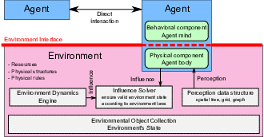
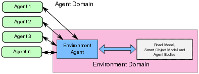
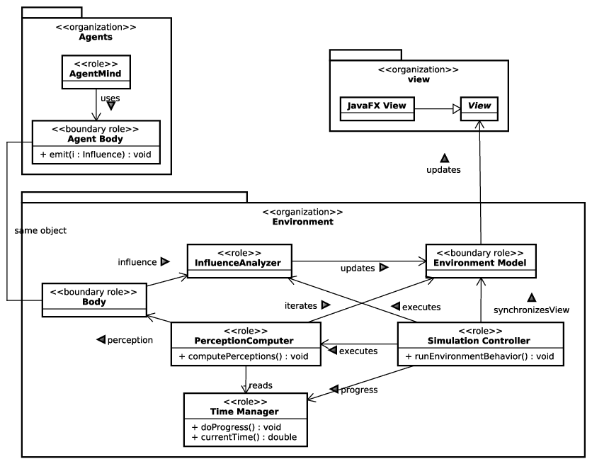

# Traffic Simulation with SARL

Author: Stéphane Galland

This file describes the key elements of a project of traffic simulation that is written with [SARL](http://www.sarl.io).

## 1. Key Principles

When defining a multiagent simulation architecture, it is required to specify how the agents will interact with their environment,
and how this interaction will be performed (i.e., how it will impact the environment and the other agents).
Four principles are stated in the literature for the definition of the architecture of a multiagent based simulator:

1. The separation between the physical representation of the agent in the environment (its body) and the agent decision
   process (its mind): to prevent an agent from directly applying actions on its body and breaking the environment state
   integrity.
   It can be noted that the body of an agent is its only interface to the environment. This means that it can only interact
   with the environment through the capacities of its body, and it can only perceive the environment through the sensors of
   its body. Thus, the environment will be in charge of the realization of the bodies capacities and in charge of providing
   perceptions to the bodies.
   In the context of this work, the body/mind separation principles cause a difference between the driver and the vehicle, as defined by:
   > Driver:
   > It supports the driving behavior, i.e., the decision processes for controlling a vehicle. It is represented by the agent itself.
   > The driver behavior is part of the agent behavior.
   
   > Vehicle:
   > It represents the physical part of the simulated vehicle, i.e., the physical properties of a vehicle (position, speed, acceleration,
   > etc.). It is represented by the concept of (mobile) agent body, that is also an object within the agent environment.
2. The influence-reaction model: to properly manage simultaneous actions from agents.
   Following this principle, an agent is not directly performing *actions* on the agent environment, which would be immediately applied.
   Instead, the agent expresses its *intentions*.
   When conflicting intentions occurs (for instance, two agents want to go to the same place at the same time), the agent environment
   resolves them and computes the corresponding reactions.
   This way the issues of simultaneous actions are solved.
   Following the stated principles, it leads us to the architecture given in Figure 1 that enforces the separation between the agent
   domain and the environment domain, with the interface between both being materialized by the agent's body.
   
   
   
3. The autonomy and the pro-activity of the agent: an agent is autonomous, it can make decisions and express influences without being
   constrained to reacting to a *simulation tick*.
   Thus, we define the agents as being *simulation agnostic*, meaning they have no knowledge on how the simulation is run. This statement
   has several implications:
   * There is no *simulation tick* triggering the decision process of the agents, an agent can make decisions and express influences,
     usually in reaction to its perceptions.
   * The perceptions are not expected to arrive simultaneously (they can, but the agent is not supposed to know if it is the case).
   * They do not know when their influences will be applied, they cannot base their decisions on their internal time and an expectation
     on the delay of application of the influences; if required, the confirmation of the application of the influences should be provided
     by the perceptions.
4. The agnosticism of the agent: an agent is not supposed to know how the simulation is managed, it should make decisions regardless
   of the implementation of the simulation.

These different principles have been considered in the design of our agent architecture. They are detailed in the following sections.

### 1.1. Agent Domain and Environment Domain

Some details must be given to shed light on the way the agent domain and the environment domain are materialized, as illustrated by
Figure 2, and how the communication between the two different domains is managed.

The agent domain is composed of agents representing the simulated entities, e.g., vehicles and connected objects.
On the other hand, we have the environment domain. This environment manages of the environment's objects, the analysis of the influences,
and the computation of the perceptions from virtual sensors for the agent bodies.
In order to be accessed from the agent domain, the environment domain exposes an interface allowing

1. simulation control through the external user interface,
2. receiving of influence from the agents, and
3. emission of perceptions to the agents.

The simulation control part provides functions for starting and pausing the simulation and running the simulation for a given amount of time.
The parts related to the receiving of the influences and the emission of the perceptions are specific to the type of environment we need to
simulate (in this paper, only a network of roads is considered).
Whatever this type of environment, the building and providing of the perception to an agent cannot be blocked by the fact that this agent has
given, or not, an influence during the previous step of the simulation loop. Therefore, even if an agent has decided to do nothing, the new
state of the environment is still provided because this state may have been changed by the actions of the other agents, and this change may
have an impact on the agent decision process.

### 1.2. Environment Agent: a joint between the SARL agents and the agent environment

We have decided to use the SARL agent metamodel for designed your agent architecture that provides general purpose agent modeling features
and a dedicated programming language.
Among the concepts defined in this metamodel, the concepts of agent, capacity, skill, event, and interaction space are used for the
specification of our agent architecture.
The SARL agents representing the drivers cannot directly access to the API of the environment, in order to avoid conflicts among their actions.
An intermediate agent, called *Environment Agent*, is introduced to manage the access to the environment data. It has multiple roles:

1. Collect the perceptions from the agent environment and transmit them to the agents.
2. Collect influences from the agents and transmit them to the agent environment.
3. Manage the execution life cycle of the simulation.
4. Manage the assignment of the bodies to the agents.

The different roles of the Environment Agent are illustrated in Figure 3 according to the capacity identification activity of the
[ASPECS methodology](http://www.aspecs.org).

The *Environment Model* contains the definition of the objects in the simulated environment, and their relationships.
The *Perception Computer* has the role to compute the set of objects in the fields of view of each agent. It iterates on the
*Environment Model* for extracting the objects' descriptions and providing them to the agent's *Body*.
The *Influence Analyzer* has the role to collect the influences that are provided by each agent's *Body*. Then, it runs an
algorithm for detecting conflicts among influences and solving them. The result of this analysis of the influences is a set of actions.
Each changes the state of the *Environment Model*.
The *Time Manager* has the role to store the current simulation time and provides functions for evolving this time.
The *Simulation Controller* has the role to schedule the simulation.
Organization *view* provides the support for external software components, such as Java FX graphical components, that can show the state
of the *Environment Model* up.
The organization *Agents* contains the simulated agents, i.e., the vehicles and the smart objects. The *Agent Body* is the same object as
the *Body* in the *Environment* organization. The *Agent Mind* is the representation of an agent behavior that controls a body.

## 2. Input Files

The input files for the simulator are usually:

1. An XML file that is describing a scenario of simulation.
2. A Shape file (ESRI format) that describes the road network.

## 3. Package structure

This section describes the packages and key types that must be defined for creating the traffic simulator.

### 3.1. fr.ciadlab.carsimu.config

Define the general configuration container for the simulator.
By default, there is no specific configuration field.

For defining your own configuration parameters you should:

#### 3.1.1. Create a configuration value container

This object contains the different values that must be stored into the configuration.
See `ExpertConfig` that provides a simple configuration field that is containing the name of an
expert associated to the simulation.

Usually, the super-type of this configuration type is one of:
* `AbstractPositionConfig`: if the configuration object has an identifier and a position on the map. 
* `AbstractIdentificableConfig`: if the configuration object has only an identifier.

#### 3.1.2. Create the accessor into the general simulator configuration

The simulator should have a general configuration accessor, named `Configuration` in the code.
This type extends the abstract 1D configuration and provides accessors to the configuration value containers.

### 3.2. fr.ciadlab.carsimu.scenario

Two classes must be defined in this package.

#### 3.2.1. The reader of the XML scenario file.

This type, usually named `XmlReader`, defines the reader of the XML simulation scenario file that is filling
the simulation configuration.

The function `loadXmlConfiguration` could be updated for reading specific XML elements and setting up the
simulation configuration.

The function `createConfigurationInstance` creates the instance of the simulation configuration to be used.

#### 3.2.2. Create the factory of simulation scenario.

The factory for creating the simulation scenario in memory is a specific sub-type of `SimulationScenarioFactory1d`.
An example of factory is provided into the `CarSimulationScenarioFactory` type.

The function `createEnvironmentModel` creates the instance of the environment model.

The function `buildSimulationScenario` reads an XML input stream and filled out a simulation scenario.
By default, this function reads the standard XML content. Its code may be extended for reading specific XML
elements from the simulation scenario file. 

### 3.3. fr.ciadlab.carsimu.environment

This package contains the definition of the simulated agent environment.
By default an agent environment is an instance of `EnvironmentModel1d`.
It may be a specific implementation extending `EnvironmentModel1d` in order to provide functions that are specific to
the application (as illustrated by the given `CarSimuEnvironmentModel` type). 

### 3.4. fr.ciadlab.carsimu.behaviors

This package provides agent behaviors (as defined in the [SARL](http://www.sarl.io) metamodel).

The `Driver` behavior provides a standard driving model. In this model, the following agent capacities are used:

* `RoadEnvironment`: to have access to the functions for moving the car.
* `PathSelection`: to have access to functions for building a road path to follow.
* `AccelerationSelection`: to have access to a function for computing the acceleration of the car.
* `CruiseSpeedManager`: to have access to a function for managing the "desired" (or cruise) speed.
* `DestinationTester`: to have access to the function that test if the agent has reached its destination.
* `HumanEvaluation`: to have access to function for applying a typical human estimation mechanism.

The event handler `on RoadPerception` is invoked each time the driver's perception has changed and the drive must provide
a motion decision.

### 3.5. fr.ciadlab.carsimu.agents

This package provides the implementation of the agents.

The `StandardCarDriver` is a `AbstractSimulatedAgent1d` that owns a driving behavior (as defined in the previous section).
The code of the agent sets the different agent skills (implementations of the agent capacities).

### 3.6. fr.ciadlab.carsimu.fx

This package provides a JAvaFX-based implementation of the user interface.

#### 3.6.1. fr.ciadlab.carsimu.fx.preferences

This package provides an implementation of the JavaFX-based preference manager. From the given example, the super-type
functions give examples of definition of preference's value accesses.
 
#### 3.6.2. fr.ciadlab.carsimu.fx.drawers

The JavaFX component that is able to draw the map elements is inspired by the standard geographical information systems.
Basically, the data to be drawn is a `MapLayer` (or any of its subtype, such as the road network layer). Each `MapLayer`
contains data that could be drawn. Because the `MapLayer` is a part of the model, it does not contain the view functions
(for drawing).
Consequently, the JavaFX component is searching for software components, named drawers, that could draw a part of the data
that are inside the `MapLayer`.

A drawer must be a class that is implementing the `Drawer` interface. We recommend to explore the type hierarchy of
the `Drawer` interface for determining what could be the best drawer's abstract implementation for your purpose.

Each drawer implementation must be declared as a service into the `META-INF/services/org.arakhne.afc.nodefx.Drawer` file.
If it is not the case, the drawer will not be dynamically discovered and used by the JavaFX component.

An example of drawer is provided: the `CarTrafficRoadPolylineDrawer` class. This drawing draws the roads with a similar look
as on Google Map for example.

#### 3.6.3. JavaFX Application

An example of JavaFX application that is launching a SARL multiagent system is provided into the `FxApp` and `FxController` classes.

The `FxApp` class represents the JavaFX application and reads the application UI definition from the `FxApp.fxml` file.

The `FxController` class implements the callback functions that are called by UI components.

### 3.6. fr.ciadlab.carsimu Main classes

Three main classes are provided into this package:

* `Main`: launch the JavaFX application.
* `MapGenerator`: first example of the programmatic generation of a road map.
* `TestMapGenerator`: second example of the programmatic generation of a road map.

